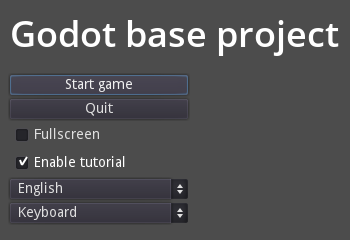
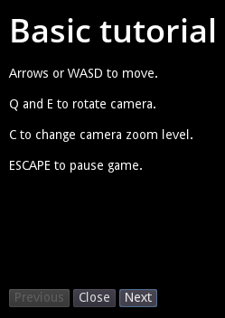
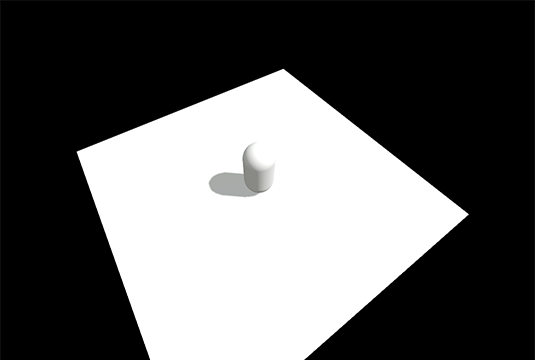
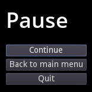

# godot-base-project

The Godot base project is an opinionated basic setup for a Godot game. Its main purpose is game jams.

_Please keep in mind that the base project is in a permanent state of "work in progress" and will keep on evolving._

## Features

### Main menu



### Tutorial



### Game



### Pause menu



## Configuration

### Localization

The available languages can be managed in `enums/Language.gd`. This demo project has two languages (English and Dutch).

The translations are stored in `translations/translations.csv`. The columns are seperated by semicolons (`;`).

### Input devices

The available input devices can be managed in `enums/InputDevice.gd`.

### Tutorials

Tutorial entries can be managed in `enums/TutorialEntry.gd`. Right now, an entry only has a title and text, but this can be expanded to include images or maybe even videos. Of course this also has to be implemented in `res://scenes/game/tutorial/Tutorial.tscn`.

### 3D camera

The game has a very basic setup for camera control, which can be found in `res://scenes/game/cam_control/CamControl.tscn`. It's a `Spatial` containing a camera. The idea is to have the camera positioned at a certain `translation` with a certain `rotation`, usually pointed towards the center of `CamControl`. The `CamControl` basically functions as a crane, following and rotating around the player.

Changing between different zoom levels is supported. These can be managed in `enums/ZoomLevels.gd`.

## Static classes

The base project has several static classes, which will be auto loaded at game start up.

### Event bus

Events can be managed in `enums/EventType.gd`.

To subscribe/unsubscribe to an event (very similar to connect):

```
EventBus.subscribe(EventType.SOMETHING_HAPPENED, self, "_on_something_happened")
EventBus.unsubscribe(EventType.SOMETHING_HAPPENED, self, "_on_something_happened")

func _on_something_happened(data):
  print_debug(data.someData)
```

_Warning, subscription will not be removed when a node is destroyed. You'll have to manually do that in the exit tree hook'._

To publish an event:

```
EventBus.publish(EventType.SOMETHING_HAPPENED, { someData:'hello!' })
```

_At the moment, the event bus is not used anywhere in the code base. It's just there in case you need it._

### Session

The `Session` represents the state of the game. Right now, it only has a `player_score`, but this can be expanded to include data like actor positions, inventory etc.

_At the moment, the session is not used anywhere in the code base. It's just there in case you need it._

### Settings

The `Settings` represents the user preference. The settings inputs in the main menu are bound to these values.

### Utils

The `Utils` class contains methods with a general purpose that I personally find helpful. Check the in-code documentation.

## Wish list

* Basic state machine
* Basic music player
* Saving/loading settings
* Saving/loading a session
* Game over state
